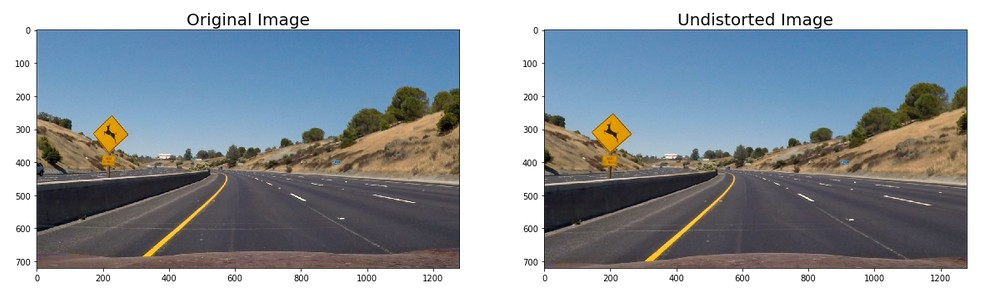

# Advanced Lane Finding
[](http://www.udacity.com/drive)


### Requirements for running this project -

1. OpenCV libraries
2. NumPy libraries
3. Natsort libraries
4. Glob libraries

---

## Problem Statement

Using computer vision principles and OpenCV library functions, develop a robust algorithm to identify and draw lanelines in a given video stream.

The goals / steps of this project are the following:

* Compute the camera calibration matrix and distortion coefficients given a set of chessboard images.
* Apply a distortion correction to raw images.
* Use color transforms, gradients, etc., to create a thresholded binary image.
* Apply a perspective transform to rectify binary image ("birds-eye view").
* Detect lane pixels and fit to find the lane boundary.
* Determine the curvature of the lane and vehicle position with respect to center.
* Warp the detected lane boundaries back onto the original image.
* Output visual display of the lane boundaries and numerical estimation of lane curvature and vehicle position.

The images for camera calibration are stored in the folder called `camera_cal`.  The images in `test_images` are for testing the pipeline on single frames.

---

### Computing the Camera Calibration Matrix

**1. Briefly state how you computed the camera matrix and distortion coefficients. Provide an example of a distortion corrected calibration image.**

The code for this section is in the pipeline.ipynb file textbox 2. Here, we execute the camera calibration matrix by providing the number of nx and ny, i.e. the number of chessboard corners in our images.

Camera images have a natural distortion present in them because of lense curvature. This curvature makes the images look distorted (fish-eye effect). To correct for this distortion, we perform camera calibration. We start by preparing two lists *imgpoints* and *objpoints* for storing the x and y co-ordinates of the detected corners in our chessboard images respectively. So, we will map the co-ordinates of the distorted image corners, i.e. *imgpoints* with real world undistorted corners, i.e. *objpoints*.

We then use the We do this by using the following functions from the OpenCV library -

[**cv2.findChessboardCorners()**](https://docs.opencv.org/2.4/modules/calib3d/doc/camera_calibration_and_3d_reconstruction.html#cv2.findChessboardCorners) for detecting chessboard corners

[**cv2.drawChessboardCorners()**](https://docs.opencv.org/2.4/modules/calib3d/doc/camera_calibration_and_3d_reconstruction.html#cv2.drawChessboardCorners) for drawing the detected chessboard corners

We use [**cv2.calibrateCamera()**](https://docs.opencv.org/2.4/modules/calib3d/doc/camera_calibration_and_3d_reconstruction.html#calibratecamera) to get the distortion coefficients *dist* and the camera calibration matrix *mtx* values. We use these values in function [**cv2.undistort()**](https://docs.opencv.org/2.4/modules/imgproc/doc/geometric_transformations.html#undistort) to get undistorted image.

Here is an example of undistorted image -


We also get the perspective transform output for a chessboard image. Here is the output for drawn corners, undistorted and transformed image.


---

## Pipeline (for laneline test images)

**2. Provide an example of a distortion-corrected image.**

We again apply above listed principles to our test images and get the undistorted images saved. Here is an example -



Other images can be found in the folder *output_images/test_images_undistorted*.

**3. Describe how (and identify where in your code) you used color transforms, gradients or other methods to create a thresholded binary image. Provide an example of a binary image result.**

Text boxes 5 and 6 include the basic thresholding and combined function definitions respectively.

I have written separate functions for applying thresholds based on hue, lightness, separation channels and sobel gradients, magnitude and direction. In addition to these functions, I have also included a combined thresholding function which combines different thresholded images together to more robustly visualize lanelines. I implemented the color transform from RGB to HLS in the combined thresholding function and submitted the HLS formatted image as input to the individual thresholding functions.
I combined thresholds from x-direction gradient, lightness and saturation thresholded binary images to get a combined thresholding image as shown below:

```python
combined_binary[((l_binary == 1) & (s_binary == 1)) & ((gradx == 1) | (s_binary == 1))] = 1
```
I also applied region of interest mask to isolate only the bottom region of the image where the lanelines are always located. Here is the code for the same -

```python
# apply region of interest mask
height, width = combined_binary.shape
mask = np.zeros_like(combined_binary)
region = np.array([[0, height-1], [int(width/2), int(height/2)], [width-1, height-1]], dtype=np.int32)
# print(region)
cv2.fillPoly(mask, [region], 1)
```

Here is an example of a thresholded and masked image for test image *straight_lines1.jpg* -


More images are saved in the *output_images/test_images_masked* folder.


**4. Describe how (and identify where in your code) you performed a perspective transform and provide an example of a transformed image.**

We define a function *perspective_view* in textbox 7 which takes as input our thresholded binary image. This function applies a perspective transform on the image. This gives us a bird's eye view of road so that the lanelines appear from the top and parallel. We select the endpoints of the laneline from a image approximately as the *src* points. We specify some destination *dst* points in the warped image so that our laneline will appear as parallel.


After this, we use the function [cv2.perspectiveTransform()](https://docs.opencv.org/2.4/modules/imgproc/doc/geometric_transformations.html#getperspectivetransform) from OpenCV library by providing *src* and *dst* points as the inputs. This function calculates the 3*3 transformation matrix. We use this transformation matrix in a function called [cv2.warpPerspective()](https://docs.opencv.org/2.4/modules/imgproc/doc/geometric_transformations.html#warpperspective) to get the warped (transformed iamge) of our lanelines.

Here is the code I used in the *perspective_view()* function -

```python
img_size = (img.shape[1], img.shape[0])

# image points extracted from image approximately
bottom_left = [210, 720]
bottom_right = [1100, 720]
top_left = [570, 470]
top_right = [720, 470]
src = np.float32([bottom_left, bottom_right, top_right, top_left])

pts = np.array([bottom_left, bottom_right, top_right, top_left], np.int32)
pts = pts.reshape((-1, 1, 2))
# create a copy of original img
imgpts = img.copy()
cv2.polylines(imgpts, [pts], True, (255, 0, 0), thickness = 3)

# choose four points in warped image so that the lines should appear as parallel
bottom_left_dst = [320, 720]
bottom_right_dst = [920, 720]
top_left_dst = [320, 1]
top_right_dst = [920, 1]

dst = np.float32([bottom_left_dst, bottom_right_dst, top_right_dst, top_left_dst])

# apply perspective transform
M = cv2.getPerspectiveTransform(src, dst)

# compute inverse perspective transform
Minv = cv2.getPerspectiveTransform(dst, src)

# warp the image using perspective transform M
warped = cv2.warpPerspective(img, M, img_size, flags=cv2.INTER_LINEAR)
```
Here is an example of a perspective transform image along with the original image. It shows us the original image along with undistorted, original warped and binary warped images.


Additional images of perspective transform can be found in the folder *output_images/tets_images_binary_warped*. (I have included only binary perspective transformed images here.)

**5. Describe how (and identify where in your code) you identified lane-line pixels and fit their positions with a polynomial?**

We use our binary thresholded perspective transformed image. We run sliding boxes approach to calculate sliding box approach to detect left and right laneline pixels in our image.

We then extract the x and y indices of detected pixels. 


We then use the function [np.polyfit()](https://numpy.org/doc/1.18/reference/generated/numpy.polyfit.html?highlight=polyfit#numpy.polyfit)


**6. Describe how (and identify where in your code) you calculated the radius of curvature of the lane and the position of the vehicle with respect to center.**


**7. Provide an example image of your result plotted back down onto the road such that the lane area is identified clearly.**


